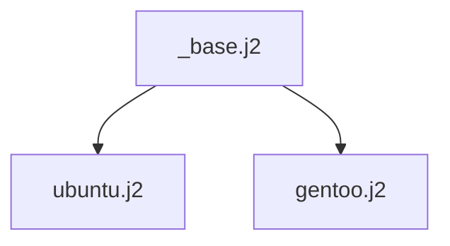

# Linux + GNOME on VM — Automated Installer

A unified, cross-platform automation that installs **Debian,
Fedora, Ubuntu LTS, or Gentoo** with
**GNOME on Wayland** inside a **QEMU** VM, fully unattended. GPU-accelerated
graphics via **VirGL** (hardware-rendered OpenGL in the guest through the
`qemu-virgl` tap). The guest
architecture follows the host — **aarch64 on Apple Silicon** (the validated
primary path) or **x86_64 on Intel Macs**. The script
always discovers the **latest** version of each distro at runtime — no
hardcoded release numbers.

## Quick start

> Already have QEMU installed?

```bash
git clone https://github.com/milesbuckton/linux-desktop-vm.git
cd linux-desktop-vm

# Default = Ubuntu LTS, vCPU = half your host's cores (clamped 2-8), 8 GB RAM, 80 GB disk
python setup_vm.py

# Watch progress with the live phase-based progress bar:
python setup_vm.py monitor ~/VMs/ubuntu-lts-qemu
```

The script downloads the latest cloud image, builds a NoCloud seed ISO
with cloud-init, generates the QEMU launch script, and launches it. Cloud-init Phase 2 (guest install) runs ~15-25 min on an idle host (Gentoo longer due to source builds); when it's done the VM reboots into GDM and you log in
with the username and its password (which defaults to the username) from
`<target_dir>/install-info.txt`.

Guests default to timezone `Africa/Johannesburg` and locale
`en_ZA.UTF-8`; `en_GB.UTF-8` and `en_US.UTF-8` are generated too.

## Provider

QEMU is the only supported hypervisor. Key advantages:

| Feature | QEMU |
|---|---|
| **Acceleration** | HVF (macOS) |
| **License** | Open source (GPLv2); no registration required |
| **Disk format** | qcow2 (native) |
| **Snapshots** | `qemu-img snapshot -c` (CLI) |
| **Install footprint** | ~200 MB qcow2 before cloud-init resize |

> **Hypervisor accelerator acronyms** (used throughout this README):
> **HVF** = Hypervisor.framework (macOS's userspace
> hypervisor API, since 10.10), **TCG** = Tiny Code Generator (QEMU's
> pure-software JIT translator — the "no hardware acceleration"
> fallback; ~10-20× slower, boot times in hours not minutes). QEMU
> picks the first of these available on the host via the
> `hvf:tcg` accelerator fallback chain.

> **Detect, don't install** — the script never auto-installs a hypervisor
> on your behalf. If `--provider` points at something not found on PATH,
> the script prints platform-specific install hints and exits.

Works on macOS hosts:
- **Apple Silicon** (aarch64 guests — the validated primary path): QEMU (HVF)
- **Intel** (x86_64 guests): QEMU (HVF)

### Guest CPU architecture

Guest architecture follows the host: **aarch64 on Apple Silicon (Apple Silicon MacBook Pro)** —
the validated primary path (the full 4-distro fleet matrix has been built
out on aarch64 guests). **x86_64 on Intel Macs** uses the same templates and
lint/simulate gates and was validated end-to-end on earlier Intel hardware.

### Per-provider virtual hardware

The guest always sees Intel HDA audio + xHCI USB 3 regardless of
provider, so PipeWire/USB code paths are identical. Disk controller,
NIC, GPU, and guest-agent stack differ — and the script's Jinja2
templates pick the right kernel/userspace pieces automatically based
on `--provider`:

| Subsystem | QEMU |
|---|---|
| **Acceleration** | HVF (macOS) |
| **Disk controller** | virtio-blk (`virtio_blk`) |
| **NIC** | virtio-net (`virtio_net`) |
| **Audio controller** | Intel HDA (`snd-hda-intel`, x86_64) / virtio-sound-pci (`virtio_snd`, aarch64) |
| **USB controller** | xHCI (`xhci_pci`) |
| **GPU host device** | `virtio-vga-gl` (x86_64) / `virtio-gpu-gl-pci` (aarch64) when the QEMU build has virgl; else `virtio-vga` → `virtio-gpu-pci` (e.g. stock Homebrew QEMU) |
| **GPU kernel driver** | `virtio_gpu.ko` |
| **Mesa gallium driver** | `virgl` (`virgl_dri.so`) with a virgl QEMU; `llvmpipe` (software) otherwise |
| **3D acceleration** | Hardware (VirGL) with a virgl QEMU; software (llvmpipe) otherwise |
| **Display session** | Wayland |
| **Mouse integration** | USB tablet (absolute coords; no capture/release) |
| **Window resolution** | 3456×2234 — QEMU `virtio-gpu-gl-pci,xres=3456,yres=2234` (aarch64) / `virtio-vga*,xres=3456,yres=2234` (x86_64) plus kernel `video=3456x2234@60` on every distro  |
| **Host SSH forward** | host port 2222 → guest port 22, **bound to 127.0.0.1 only** (never exposed on the LAN; the generated launcher probes a free port in 2222-2322 at launch) |
| **Firmware** | UEFI via OVMF |
| **VM definition file** | `launch-vm.sh` (provider-native QEMU argv) |

The guest is configured identically across providers from a desktop
user's perspective: sound, USB, 3D-accelerated graphics, NetworkManager,
PipeWire, GDM (Wayland session), and cloud-sync tooling.

## Supported distros

| `--distro` | Resolves to | Release model | Hash | Default user | Default hostname | Template | Resolver | Cloud image source | Firmware |
|---|---|---|---|---|---|---|---|---|---|---|
| `ubuntu-lts` (default) | Latest Ubuntu LTS | 2-year cadence | SHA256 | `ubuntu` | `ubuntu-lts-vm` | `ubuntu.j2` | `_resolve_ubuntu_lts` | `https://cloud-images.ubuntu.com/` | UEFI |
| `gentoo` | Latest Gentoo cloud image (rolling) | Rolling | SHA256 | `gentoo` | `gentoo-vm` | `gentoo.j2` | `_resolve_gentoo` | `https://distfiles.gentoo.org/releases/` | UEFI |

### Guest kernels and GNOME versions

What today's cloud images ship inside these VMs (these float with upstream
releases, so treat them as a snapshot):

| Distro | Kernel | GNOME Shell |
|---|---|---|
| `ubuntu-lts` (26.04) | 7.0.0-28-generic | 50.1 |
| `gentoo` | 6.18.43-gentoo-dist | 49.7 |

### Curated GNOME Shell extensions

Six GNOME Shell extensions are installed and enabled system-wide (dconf
default `05-extensions`). The guest fetches the zips from a **host-served
local HTTP server** (QEMU's `10.0.2.2` gateway) during cloud-init — **not**
directly from GitHub/EGO, whose connection is flaky at first boot  — so installs are deterministic. A shell-version gate skips any
extension whose release does not declare the guest's GNOME major, so only the
extensions that actually support the running GNOME version land on disk.

Three extensions support GNOME 48–50, so they install on **every** distro.
The other four are builds with narrower version ranges (
the original GNOME-44/46 builds; #50 re-added the hermes83 compiz originals
fetched from their `master` branch + a Gitea-hosted dynamic-panel-ng; #51 added
the velade `dynamic-panel` build for GNOME 46–49). The dynamic-panel role is
split across two builds so each GNOME version gets exactly one. Coverage is
per-GNOME-version:

| Extension | Source | Installs on |
|---|---|---|
| burn-my-windows (`burn-my-windows@schneegans.github.com`) | GitHub | GNOME 48–50 (all distros) |
| desktop-cube (`desktop-cube@schneegans.github.com`) | GitHub | GNOME 48–50 (all distros) |
| dash-to-dock (`dash-to-dock@micxgx.gmail.com`) | GitHub | GNOME 48–50 (all distros) |
| dash-to-panel (`dash-to-panel@jderose9.github.com`) | GitHub (home-sweet-gnome, pinned v73) | GNOME 46–50 (all distros) — **installed but DISABLED by default** (opt-in alternative to Dash to Dock) |
| compiz-alike-magic-lamp-effect (`compiz-alike-magic-lamp-effect@hermes83.github.com`) | GitHub (hermes83, `master`) | GNOME 48–50 (all distros) |
| compiz-windows-effect (`compiz-windows-effect@hermes83.github.com`) | GitHub (hermes83, dual build: v29 + `master`) | GNOME 48–50 (all distros) |
| dynamic-panel (`dynamic-panel@velhlkj.com`) | GitHub (velade) | GNOME 46–49 (Debian, Gentoo) |
| dynamic-panel-ng (`dynamic-panel-ng@jdneer.com`) | Gitea (jdneer) | GNOME 50 only (Fedora, Ubuntu) |

Net per-distro on-disk count: **7 installed, 6 enabled by default** on every
distro. The 7th, `dash-to-panel`, is pinned to v73 (GNOME 46–50) and installed on
all four distros, but its uuid is deliberately omitted from the dconf
`enabled-extensions` list, so it lands on disk **disabled** until toggled on in
the Extensions app. Enabling it while Dash to Dock is also enabled makes both
fight over the panel/dash, so only one should be on at a time. `compiz-windows-effect`
is served as two version-specific builds (v29 commit for GNOME ≤49, `master`
for GNOME 50); the guest picks the matching artifact by its GNOME version, so
Debian (48), Gentoo (49) and Fedora / Ubuntu (50) all install it. This is
upstream version support, not a build bug — the gate only installs what each
extension itself claims to support.

## Apps preinstalled on every VM

Every VM built by this tool gets the same curated set of apps via **native packages**, visible in the **GNOME Software** GUI.

### Native packages (all 4 distros)

Same app on all 4 distros; the exact package name differs by distro (the
[Package naming differences](#package-naming-differences) legend below is
the canonical per-name reference).

| Slot | What it is |
|---|---|
| **Cloud sync CLI** | `rclone` |
| **GNOME Console** | Default terminal |
| **GNOME Text Editor** | Default plain-text "notepad" (replaced gedit in GNOME 42+) |
| **yelp** | GNOME Help viewer (F1 from any GNOME app opens here) |
| **GNOME Videos (Totem)** | Default GNOME video player |
| **GNOME Loupe** | Default GNOME image viewer (replaces Eye of GNOME) — native on all 4 distros (Gentoo unmasks `media-gfx/loupe ~arm64`) |
| **Snapshot (camera)** | Default GNOME camera (Cheese's successor) — on Gentoo installed via Flathub (`org.gnome.Snapshot`, no ebuild yet); native on the other 3 distros |
| **GNOME Papers** | Default PDF / document viewer |
| **Geary** | Lightweight modern GNOME mail client (conversation-threaded, IMAP/OAuth2) |
| **Python tooling** | `python3` (interpreter) is base on every distro; we add pip and venv where separate |
| **GNOME Extensions GUI** | Browse/enable/disable GNOME shell extensions |
| **Google Chrome** | Best-effort vendor-repo install ⁴ — `google-chrome-stable`, native package name identical on all 4. Installs on **both x86_64 and aarch64** (Google ships arm64/aarch64 Linux builds). Also **simulate-validated** (see ⁴). |
| **Flatpak + Flathub** | `flatpak` framework preinstalled on all 4 + the Flathub remote registered (GNOME Software's Flatpak plugin installs from it). |
| **Flatseal** | Flatpak permission manager, installed from Flathub (best-effort ⁴). |
| **Gear Lever** | Flatpak app manager (upgrade/downgrade/backup), installed from Flathub (best-effort ⁴). |
| **Picture of the Day** | Daily wallpaper (Wikipedia POTD, NASA APOD, …), installed from Flathub (best-effort ⁴). |
| **PowerShell** | Best-effort universal tarball install (`pwsh`) — pulled from the GitHub release for the guest arch and symlinked to `/usr/local/bin/pwsh`. Not package-manager tracked (no auto-update); chosen over the Microsoft apt/dnf repos because those lag the newest distro bases (Ubuntu 26.04 / Debian 13 / Fedora 44). Emits `POWERSHELL-OK` / `POWERSHELL-MISSING` in the cloud-init log (best-effort ⁴). |

### Distro branding (wallpaper + lock screen)

Every VM boots with its distro's own branded wallpaper as both the desktop background and lock screen, set via system-wide dconf. The branding package per distro:

| Distro | Branding package | Wallpaper source | Accent color |
|--------|-----------------|-----------------|--------------|
| Ubuntu | `ubuntu-wallpapers` (transitive via `ubuntu-desktop-minimal`) | `/usr/share/backgrounds/*-final-ubuntu.png` | Orange |
| Gentoo | `x11-themes/gnome-backgrounds` (explicit; GNOME default) + `x11-themes/adwaita-icon-theme` + `x11-themes/gnome-themes-standard` | `/usr/share/backgrounds/` (GNOME default) | GNOME default (blue) |

LibreOffice is preinstalled on all distros (pulled in by the desktop meta-packages on apt/dnf).

### GNOME desktop defaults (dconf, all 4 distros)

Set via system-wide dconf database (`/etc/dconf/db/local.d/`) so every user inherits these on first login:

| Setting | Value | Why |
|---|---|---|
| `org.gnome.Epiphany.web enable-webextensions` | `true` | Epiphany supports WebExtensions but ships disabled-by-default. We enable it system-wide. |
| `org.gnome.desktop.interface color-scheme` | `'prefer-dark'` | Default to dark mode. Users can flip via Settings → Appearance. |
| `org.gnome.mutter dynamic-workspaces` | `false` | |
| `org.gnome.desktop.wm.preferences num-workspaces` | `1` | Boot with exactly one workspace, no auto-spawned extras. Toggle back to dynamic via Settings → Multitasking. |
| `org.gnome.desktop.background picture-uri` / `picture-uri-dark` | Distro wallpaper | Each distro gets its own branded default desktop wallpaper. |
| `org.gnome.desktop.screensaver picture-uri` | Distro wallpaper | Lock screen matches the desktop background. |
| `org.gnome.desktop.interface accent-color` | Distro-specific (see below) | Distros with official GNOME branding (Ubuntu orange, Fedora blue) get their accent color. Others keep vanilla GNOME blue. |

## Distro alignment caveats

The installer aims for the same user-facing GNOME desktop everywhere, but
Linux distro release cycles and package naming do not fully align.

### No Firefox by design

Firefox is deliberately **not** installed on any distro. Ubuntu's
metapackages only *Recommend* it (via the snap shim), and the existing
`snapd` pin at priority −1 in `99-no-bloat.pref` keeps that
recommendation unresolvable, so the shim can never sneak back in.
Epiphany is the preinstalled browser on every VM.

### Current versions

### Camera and image viewer on Gentoo

**Loupe** (image viewer, `media-gfx/loupe`) is now `~arm64`-keyworded in
the Gentoo tree and is unmasked via `package.accept_keywords`, so it is
installed natively by the install script — same path as the other distro.
**Snapshot** (camera) still has no Gentoo ebuild, so it alone is installed
from Flathub best-effort (`org.gnome.Snapshot`). The cloud-init log records
`SNAPSHOT-FLATPAK-OK` / `SNAPSHOT-FLATPAK-MISSING` markers (best-effort — a
Flathub blip never sinks the build).

### Adobe Reader

Not installed. Adobe has shipped no Linux Reader,
Flathub's community `com.adobe.Reader` wrapper is x86_64-only and
unmaintained, and the native PDF viewer (**Papers** / Evince) is installed
on every distro anyway.

### Package naming differences

The installer targets the **same user-facing GNOME desktop everywhere**, but
distro package managers name the underlying packages differently. The
table below is the canonical legend for checking package naming.

Columns are grouped by package-manager family because within a family
the package name is almost always identical (Debian + Ubuntu share apt
names; Fedora shares dnf names; Gentoo uses portage `category/name`
atoms). Exceptions are footnoted.

| Capability | apt (Debian / Ubuntu) | dnf (Fedora) | portage (Gentoo) |
|---|---|---|---|
| GNOME desktop meta | `task-gnome-desktop` (Debian) / `ubuntu-desktop-minimal` (Ubuntu) | `@workstation-product-environment` (Fedora) | `gnome-base/gnome` (via `@gnome-set` meta) |
| Display manager | `gdm3` | `gdm` | `gnome-extra/gdm` |
| GNOME Tweaks | `gnome-tweaks` | `gnome-tweaks` | `gnome-extra/gnome-tweaks` |
| GNOME Software | `gnome-software` | `gnome-software` | `gnome-extra/gnome-software` (flatpak via USE) |
| Console (terminal) | `gnome-console` | `gnome-console` | `gui-apps/gnome-console` |
| Text editor | `gnome-text-editor` | `gnome-text-editor` | `gui-apps/gnome-text-editor` |
| Camera (Snapshot) | `gnome-snapshot` | `snapshot` | (Flathub `org.gnome.Snapshot` — not in tree) |
| Sound recorder | `gnome-sound-recorder` | `gnome-sound-recorder` | `gui-apps/gnome-sound-recorder` |
| PDF viewer (Papers) | `papers` | `papers` | `app-text/papers` |
| Image viewer | `loupe` | `loupe` | `media-gfx/loupe` (Flathub `org.gnome.Loupe` on arm64) |
| Video player (Totem) | `totem` | `totem` | `media-video/totem` |
| Mail (Geary) | `geary` | `geary` | `mail-client/geary` |
| Web browser (Epiphany) | `epiphany-browser` | `epiphany` | `www-client/epiphany` |
| GNOME Bluetooth UI | `gnome-bluetooth` | `gnome-bluetooth` | `gnome-extra/gnome-bluetooth` |
| GNOME Extensions GUI | `gnome-shell-extensions` | `gnome-extensions-app` | `gnome-extra/gnome-shell-extensions` |
| Bluetooth daemon | `bluez` | `bluez` | `net-wireless/bluez` |
| GVFS backends (MTP / gphoto2) | `gvfs-backends` (umbrella) | `gvfs-mtp` + `gvfs-gphoto2` (split) | `gnome-extra/gvfs` (umbrella) |
| Mesa demos (glxgears, glxinfo) | `mesa-utils` | `glx-utils` | `x11-apps/mesa-progs` |
| Vulkan tools (vulkaninfo, vkcube) | `vulkan-tools` | `vulkan-tools` | `dev-util/vulkan-tools` (vulkaninfo only — `cube` USE is masked on arm64, so `vkcube` is built from upstream source during install) |
| Vulkan loader + drivers | `mesa-vulkan-drivers` + `vulkan-loader` | `mesa-vulkan-drivers` + `vulkan-loader` | `media-libs/vulkan-loader` + `media-libs/mesa` |
| PipeWire | `pipewire` + `pipewire-pulse` | `pipewire` + `pipewire-pulseaudio` | `media-video/pipewire` + `media-sound/pipewire-pulse` |
| ALSA plugin | `pipewire-alsa` | `pipewire-alsa` | `media-sound/pipewire-alsa` |
| JACK plugin | `pipewire-jack` | `pipewire-jack` | `media-libs/pipewire-jack` |
| WirePlumber | `wireplumber` | `wireplumber` | `media-video/wireplumber` |
| rtkit | `rtkit` | `rtkit` | `sys-auth/rtkit` |
| Python pip | `python3-pip` (+ `python3-venv`) | `python3-pip` (+ `python3-venv`) | `dev-python/pip` |
| Fira Code font | `fonts-firacode` | `fira-code-fonts` | `media-fonts/fira-code` |
| fastfetch | `fastfetch` | `fastfetch` | `app-misc/fastfetch` |
| lsb-release | `lsb-release` | `lsb_release` | `sys-apps/lsb-release` |
| net-tools (ifconfig) | `net-tools` | `net-tools` | `sys-apps/net-tools` |
| usbutils (lsusb) | `usbutils` | `usbutils` | `sys-apps/usbutils` |
| rclone | `rclone` | `rclone` | `net-misc/rclone` |
| Google Chrome | `google-chrome-stable` | `google-chrome-stable` | `www-client/google-chrome` |
| Flatpak runtime | `flatpak` | `flatpak` | `sys-apps/flatpak` |
| Flatseal (Flathub) | `com.github.tchx84.Flatseal` | `com.github.tchx84.Flatseal` | `com.github.tchx84.Flatseal` |
| Gear Lever (Flathub) | `it.mijorus.gearlever` | `it.mijorus.gearlever` | `it.mijorus.gearlever` |
| Picture of the Day (Flathub) | `de.swsnr.pictureoftheday` | `de.swsnr.pictureoftheday` | `de.swsnr.pictureoftheday` |
| GNOME backgrounds | `gnome-backgrounds` | `gnome-backgrounds` | `x11-themes/gnome-backgrounds` |
| Icon theme (Adwaita) | `adwaita-icon-theme` | `adwaita-icon-theme` | `x11-themes/adwaita-icon-theme` |
| GTK themes (standard) | `gnome-themes-extra` | `gnome-themes-extra` | `x11-themes/gnome-themes-standard` |
| Mesa userspace GL stack | (pulled in by desktop meta) | (pulled in by `@workstation`) | (pulled in by `gnome-base/gnome`) |

² All four distros now install the `papers` package; Debian/Ubuntu retired the GNOME-47-era `evince` name in this release.

³ All apt/dnf distros install `python3-venv` explicitly alongside `python3-pip` for consistency. On Gentoo, venv is part of the Python base package.

⁴ **Best-effort vendor/third-party installs** — Google Chrome and the Flathub apps are best-effort: a vendor-repo or network blip must never sink the build . The guest's cloud-init log records `CHROME-OK` / `CHROME-MISSING` and `FLATPAK-APPS-OK` / `FLATPAK-APPS-MISSING` markers. Chrome (and Firefox on Ubuntu, via the Mozilla APT repo) are ALSO in the simulate dry-run lists — their vendor repos are registered in `bootcmd`, which runs in simulate mode too — so a Google/Mozilla repo or arch regression surfaces at the simulate gate instead of as a marker in a multi-hour build.

## Files

| File | Purpose |
|------|---------|
| `setup_vm.py` | Thin shim — delegates to `linux_vm/` package (backwards-compat entry point) |
| `linux_vm/` | Core package: orchestrator, providers, download, templates, monitor |
| `scripts/build-fleet-sequential.py` | Sequential multi-VM builder (see [ARCHITECTURE.md](./docs/ARCHITECTURE.md)) |
| `templates/_base.j2` | Master cloud-init template (Jinja2 inheritance root) |
| `templates/_apt_family.j2` | Shared apt family base for Debian / Ubuntu: 46-package core (`_apt_core_pkgs`), parameterised `bootcmd` (DNS fix + no-bloat pins), default `post_runcmd` tail; children add uniques only |
| `templates/_write_files_common.j2` | Shared `/etc/issue` + `check-vm` diagnostic (included by `_base.j2`) |
| `templates/_runcmd_common.j2` | Shared display manager / vmtools / PipeWire / AccountsService runcmd (included by `_base.j2`) |
| `templates/_dconf_common.j2` | Shared GNOME dconf defaults (included by all family templates) |
| `templates/_plymouth_common.j2` | Shared Plymouth boot-splash setup (theme + grub/initrd regen; included in `post_runcmd`) |
| `templates/_app_platforms_common.j2` | Shared vendor-app platform installs (Google Chrome, Flathub Flatseal/Gear Lever/Picture of the Day, PowerShell) |
| `templates/network-config.j2` | Netplan YAML for DHCP on `e*` interfaces |
| `templates/ubuntu.j2` | Ubuntu LTS (standalone; inlined `_apt_family.j2` content) |
| `templates/gentoo.j2` | Gentoo (extends `_base.j2` directly) |
| `templates/meta-data.j2` | cloud-init meta-data (per-VM identity) |
| `scripts/lint-templates.py` | Template linter (see [ARCHITECTURE.md](./docs/ARCHITECTURE.md)) |
| `scripts/smoke-test-cli.py` | CLI contract smoke test (see [ARCHITECTURE.md](./docs/ARCHITECTURE.md)) |
| `scripts/audit-packages.py` | Cross-distro package alignment audit (see [ARCHITECTURE.md](./docs/ARCHITECTURE.md)) |

The templates directory uses Jinja2 template inheritance to deduplicate
common cloud-init config. The hierarchy is:



Gentoo extends `_base.j2` directly (no family template). See [ARCHITECTURE.md](./docs/ARCHITECTURE.md) for the full diagram.

## Prerequisites

You install QEMU yourself — the script
detects it via `--provider` and refuses to start
if it can't find it (printing platform-specific install hints).

### QEMU + OVMF (`--provider qemu`)

QEMU is open source, no registration required, no commercial gate.
You need the system emulator (`qemu-system-x86_64` on Intel, or
`qemu-system-aarch64` on Apple Silicon — the guest arch follows the host),
`qemu-img`, and the OVMF firmware blobs for UEFI boot.

| Host | Install command |
|------|-----------------|
| macOS | `brew install qemu`. HVF acceleration is built into macOS — no extra step. |
| macOS (hardware GL) | Optional: `brew tap milesbuckton/qemu-virgl && brew install milesbuckton/qemu-virgl/qemu-virgl`. QEMU **11.0.3** with virglrenderer + ANGLE/Metal. Prebuilt **Apple Silicon bottles** (arm64_tahoe/sequoia) are published as GitHub Release assets and poured by Homebrew — no source build; from-source builds (full Xcode) only if no bottle matches. Verified working on this project's Apple Silicon MacBook Pro host. The launcher auto-detects the GL devices (`virtio-vga-gl`/`virtio-gpu-gl-pci`) and uses `-display cocoa,gl=es`; without it the guest renders with Mesa `llvmpipe` (software GL) — see . Note the tap shadows the Homebrew `qemu` binary in `PATH` (`brew link --overwrite qemu-virgl`), and macOS-virgl is not yet in upstream QEMU, so a virgl build can never be the absolute latest QEMU. |

### Shared: qemu-img

The QEMU system emulator bundle already
includes qemu-img — no extra step needed.

### Host resources (multi-core matters)

The default VM uses **half the host's physical CPU cores (clamped to 2-8)**
for vCPUs — 8 on an 18-core Apple Silicon MacBook Pro, 2 on a 4-core Mac — plus **8 GB RAM /
80 GB disk** (tune via `--vcpus` / `--memory-mb` / `--disk-gb`). Halving
leaves the other half of the cores free for the host and other apps: a
full-core VM on a small busy host starves the guest vCPUs — the guest
kernel soft-locks and cloud-init stalls (see
). For the fastest, most reliable fleet
runs, keep the machine otherwise idle.

## Usage

```bash
# Default: Ubuntu LTS, vCPU = half your host's cores (clamped 2-8), 8 GB RAM, 80 GB disk, user password = username (see install-info.txt)
python setup_vm.py

# Or pick any distro explicitly:
python setup_vm.py --distro ubuntu-lts           # Ubuntu LTS -- default

# Running 3+ concurrent builds? Pin SSH-forward ports explicitly:
python setup_vm.py --ssh-port 2222 --target-dir ~/VMs/q1 &
python setup_vm.py --ssh-port 2224 --target-dir ~/VMs/q2 &

# Custom settings (defaults: vCPU = half your host's cores / 8 GB RAM / 80 GB disk)
python setup_vm.py \
    --distro ubuntu-lts \
    --target-dir ~/VMs/my-vm \
    --hostname my-ubuntu \
    --username alex \
    --vcpus 4 \
    --memory-mb 8192 \
    --disk-gb 80

# Build everything (default is build-only, no VM boot)
python setup_vm.py
```

Run `python setup_vm.py --help` to see all options.

To build all 4 distros at once, see
[ARCHITECTURE.md](./docs/ARCHITECTURE.md).

### Default target directory

| OS | Default `--target-dir` |
|----|------------------------|
| macOS | `~/VMs/<distro>-<provider>` |

The `-<provider>` suffix (`-qemu`) identifies the hypervisor used.

### Default credentials

Two accounts are created on every VM:

| Account | Default password | Notes |
|---|---|---|
| Primary user (matches `--username`, default = distro-specific user) | **the username itself** | The account you log into GDM / Wayland with. Has sudo via `wheel` (or `sudo`) group. |
| `root` | **`root`** | Set by cloud-init as a fallback for console emergency access. SSH password auth for root is enabled. |

Override the primary-user password with `--password X`. Whatever
passwords end up in use are recorded — and only recorded — in
`<target-dir>/install-info.txt` (chmod 600). It is the single place to
look for login credentials after a build; the terminal prints them once
in the "Setup complete" summary.

> Predictable credentials are safe here because the host SSH forward is
> **loopback-only** (never exposed on the LAN) — see [Architecture](./docs/ARCHITECTURE.md).
> If you ever change the launcher to bind the forward on a non-loopback
> address, regenerate with a stronger password first.

## Distro Comparison (in this script's defaults)

| | Ubuntu LTS | Gentoo |
|---|---|---|
| Release model | 2-year cadence, 5-year support | Rolling |
| GNOME freshness | Stable | Latest (from upstream ebuilds) |
| Default user | `ubuntu` | `gentoo` |
| Sudo group | `sudo` | `wheel` |
| Cloud sync CLI | `rclone` | `rclone` |
| Firmware | UEFI | UEFI |
| Typical first-boot time (Phase 2, measured) | ~15 min | ~2-3 h (source builds) |

Ubuntu LTS is the stability track with 5 years of patches — the default
Ubuntu target.

## Verifying the install

When the VM finishes setup it reboots automatically. You'll see the GDM
login screen — sign in with the username and password from `install-info.txt`.

```bash
echo $XDG_SESSION_TYPE      # should print: wayland
gnome-shell --version       # latest GNOME for the chosen distro
```

## First boot — what to expect

The VM **boots twice** before GDM is ready. The first boot runs cloud-init
(install GNOME, configure services); cloud-init then triggers an
automatic reboot, and the second boot brings up GDM.

**Don't run the distro's package manager manually during the first boot.**
Cloud-init is already running it, and a concurrent `apt`/`dnf`
will hit a database lock. If you've logged into the console while
cloud-init is still going, just wait — the VM will reboot itself when
it's done.

### How to tell whether cloud-init has finished

```bash
sudo cloud-init status
# status: running   -> still installing, wait
# status: done      -> finished, reboot is imminent (or already happened)
# status: error     -> something failed; see logs
```

To block until done:
```bash
sudo cloud-init status --wait
```

For more detail:
```bash
sudo cloud-init analyze show          # phase-by-phase timing
sudo journalctl -u cloud-init-final --no-pager | tail -30
sudo tail -f /var/log/cloud-init-output.log    # follow live
```

### The "ground truth" marker

Each user-data template writes a marker file as its very last runcmd
step:

| Distro | Marker path |
|--------|-------------|
| Ubuntu LTS | `/var/log/ubuntu-lts-vm-setup.log` |
| Gentoo | `/var/log/gentoo-vm-setup.log` |

```bash
ls -l /var/log/*-vm-setup.log
cat /var/log/*-vm-setup.log
# Expected: cloud-init first-boot finished at: YYYY-MM-DD...
```

### Built-in diagnostic: `check-vm`

Every VM gets `/usr/local/bin/check-vm`. Run it as soon as you see the
login prompt:

```bash
check-vm
```

Output covers:
- cloud-init status and per-module exit codes
- Whether the marker file exists (runcmd completed)
- Network interfaces, DNS, connectivity
- Display manager state and default systemd target
- Package manager state
- IP and SSH command
- Errors in both cloud-init logs

The same IP + SSH line is also baked into `/etc/issue`, so it shows
above every console login prompt.

## Troubleshooting

**cloud-init never finishes:**
First boot does a full system upgrade plus desktop install (allow up to
16 min; slower networks may add a few minutes). SSH is enabled —
`ssh user@<vm-ip>` or `ssh -p 2222 user@127.0.0.1` (QEMU) and tail
`/var/log/cloud-init-output.log` to watch progress. Or run
`setup_vm.py monitor <target_dir>` for a phase-based progress bar.

**Vulkan: which driver does the guest get?**
- **QEMU (virtio-vga)**: If the host's QEMU has Venus (Vulkan-over-virtio) compiled in, the guest gets hardware-accelerated Vulkan. The script auto-detects this. Otherwise, you get Lavapipe (CPU-side Vulkan via LLVM JIT).

**QEMU window opens small (640×480 text mode):**
Expected for the first ~60 seconds of boot — text-mode VGA happens
before the virtio-gpu kernel driver loads. Resolution jumps to the
host-native 3456×2234 once GDM starts (pinned by the `video=3456x2234@60`
kernel arg on every distro; the arg applies on the reboot
*after* cloud-init).

**QEMU: no cocoa window appears (headless):**
The generated `launch-vm.sh` opens a cocoa window by default — with
`-display cocoa,gl=es` + a GL device (`virtio-vga-gl` / `virtio-gpu-gl-pci`)
on a virgl QEMU build, or plain `-display cocoa` + `virtio-vga` /
`virtio-gpu-pci` otherwise. If you need headless operation (e.g. for CI /
fleet runs), edit the launcher to swap:
- `-display cocoa,gl=es` (or `-display cocoa`) → `-display none`
- the GL device (if present) → its non-GL sibling (`virtio-vga-gl` →
  `virtio-vga`, `virtio-gpu-gl-pci` → `virtio-gpu-pci`); the GL-capable
  devices need a GL display backend, so they must be dropped with
  `-display none`

**SPICE clipboard / USB redirection not available (QEMU):**
A `-spice` server is intentionally not attached. QEMU rejects `-spice`
alongside a GL display context — `-spice` + `-display cocoa,gl=es` aborts
with "Display spice is incompatible with the GL context" (upstream QEMU
constraint: SPICE would never receive display updates once GL owns the
framebuffer, qemu/qemu#1036). The GL display is what makes the virgl
hardware-rendering path work, so the SPICE server lost the trade-off. The
guest still runs the `spice-vdagent` channel (see history in
).

**Concurrent QEMU builds: second VM's SSH-forward not working:**
Both builds try to grab host port 2222 by default. For 3+ concurrent
builds, pass `--ssh-port N` explicitly to each:
```bash
python setup_vm.py --provider qemu --ssh-port 2222 --target-dir ~/VMs/q1 &
python setup_vm.py --provider qemu --ssh-port 2224 --target-dir ~/VMs/q2 &
python setup_vm.py --provider qemu --ssh-port 2226 --target-dir ~/VMs/q3 &
```

**Discovery failed:**
The mirrors / changelogs server is the source of truth. Re-run when
network issues clear.

## Day-2 operations

Once the VM is up and you've logged into GDM, the script's job is done
— but here are the workflows you'll typically want.

### Watching cloud-init progress

```bash
python setup_vm.py monitor ~/VMs/ubuntu-lts-qemu        # live phase bar, 5-sec refresh
python setup_vm.py monitor ~/VMs/ubuntu-lts-qemu --once # snapshot, exit
```

For live-tail mode (streams every package-manager line via SSH):
```bash
python setup_vm.py monitor ~/VMs/ubuntu-lts-qemu --tail
```
Tail mode requires `paramiko` (`pip install paramiko`) and the per-VM
`ssh_key` file that the build generates automatically.

### SSH into a running VM

- **QEMU**: `ssh -p 2222 user@127.0.0.1` (or whatever port was assigned;
  printed in the build output). The host forward is **loopback-only** by
  design — never accessible from the LAN — so you must SSH to
  `127.0.0.1`, not the Mac's LAN IP. Only change the bind in
  `launch-vm.sh` if you understand the exposure.

Two ways to authenticate:

1. **Password** — whatever's in `<target-dir>/install-info.txt`.
2. **Per-VM SSH key** — `<target-dir>/ssh_key` (ed25519, generated at
   build time). Works as soon as sshd starts inside the guest:
   ```bash
   ssh -i ~/VMs/ubuntu-lts-qemu/ssh_key -p 2222 ubuntu@127.0.0.1
   ```

### Snapshots

Snapshot the VM before invasive changes; restore in seconds if something
breaks.

| Take snapshot | Restore | List |
|---|---|---|
| `qemu-img snapshot -c <name> disk.qcow2` (VM must be off) | `qemu-img snapshot -a <name> disk.qcow2` | `qemu-img snapshot -l disk.qcow2` |

### Stopping / starting a VM

| Soft shutdown (ACPI) | Force off | Start |
|---|---|---|
| Close the QEMU window's File → Power Down menu, or `system_powerdown` in QEMU monitor | Close the window / kill the qemu process | Re-run the generated `launch-vm.sh` |

### Cleanup

To fully delete a VM and reclaim disk:

```bash
rm -rf ~/VMs/ubuntu-lts-qemu     # QEMU
```

## Re-running

- The cloud image is reused if the URL hasn't changed (Fedora respins,
  Ubuntu daily builds, and Debian point
  releases all produce new filenames and trigger a re-download).
- The provider-specific disk (qcow2) is regenerated each run.
- The seed ISO + VM definition file are always regenerated.

Delete the target directory for a clean re-install.

## Further reading

- [**ARCHITECTURE.md**](./docs/ARCHITECTURE.md) — internal flow, latest-version discovery,
  pre-flight gates, timing data, fleet building
- [**AGENTS.md**](./AGENTS.md) — maintainer guide, conventions, gotchas

## License

Provided as-is. Adapt the templates and orchestrator to your needs.