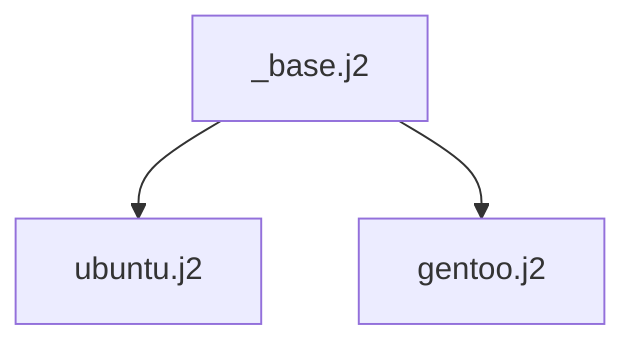

# linux-desktop-vm — Architecture & Fleet Guide

This document covers the internal architecture, build phases, pre-flight
gates, timing data, and fleet-building orchestration. It's intended for
developers and maintainers — end users should start with [README.md](../README.md).

## Template hierarchy


```mermaid
flowchart TB
  base["_base.j2"]
  ubuntu["ubuntu.j2"]
  gentoo["gentoo.j2"]

  base --> ubuntu
  base --> gentoo
```

Each concrete template is self-contained. `ubuntu.j2` owns the full APT
stack (inlined from the retired `_apt_family.j2`).

## Latest-Version Discovery

Each distro's "latest" is resolved at runtime, not hardcoded:

| Distro | Source of truth |
|--------|----------------|
| Ubuntu LTS | Canonical cloud-image metadata; highest supported LTS wins |
| Gentoo | `distfiles.gentoo.org` autobuilds index (latest `di-<arch>-cloudinit-*.qcow2`) |

When a new release ships (Ubuntu 28.04 LTS, etc.), the script
picks it up automatically with no code change.

## How It Works (internal flow)

1. Detect host (macOS on arm64) and locate QEMU tools.
2. Auto-install `qemu-img` if missing (via Homebrew).
3. Auto-install `pycdlib`, `certifi`, and `jinja2` pip packages. Inside a venv this installs directly into the venv; outside, it uses `--user` scope with a `--break-system-packages` fallback for PEP 668 (externally-managed) environments.
4. Resolve the chosen distro's latest cloud image URL + hash.
5. Download + verify the cloud image (SHA256 or SHA512 depending on distro).
6. Resize qcow2 to target disk size using `qemu-img resize`.
7. Render cloud-init templates with hostname / username / password / TZ.
8. Build a NoCloud seed ISO (volume label `cidata`) using `pycdlib`.
9. Render the VM definition file (shell launcher script).
10. Start the VM via the shell launcher script (QEMU on macOS with HVF).

Inside the guest, cloud-init then:
- Sets hostname, creates the user with sudo, sets the password
- Updates packages and installs the desktop (distro-specific install path)
- Sets `graphical.target` as default, enables the display manager
- Reboots into the GDM login screen (Wayland session)

## Code Organization

The orchestration lives in `linux_vm/` (see [AGENTS.md](../AGENTS.md)'s repository layout).
`_build_one_vm()` in `linux_vm/orchestrate.py` delegates to
single-responsibility helpers:

1. **`_find_or_install_qemu_img(host)`** - Locate or install qemu-img
2. **`_install_if_missing(installer_func, package_name)`** - Centralized prerequisite dependency handling (the `ensure_pycdlib` / `ensure_certifi` / `ensure_jinja2` installers catch their own ImportErrors)
3. **`_build_vm_config(args, host, defaults, resolved)`** - Build and configure VM configuration with distro-specific VM name logic (uses the already-resolved distro object; resolve happens once before config)
4. **`_ensure_image(resolved, qcow2, cache_dir, distro)`** - Download, hash verification, and cache management. The shared-cache path (`download_to_cache`) verifies the hash once on the cached file; a hardlink into the target dir shares that inode so it is not re-hashed, while a real cross-volume copy gets its own verification. A stale target image is detected by the reuse-path hash check and re-downloaded.

`_build_one_vm()` runs these in four phases: QEMU detection, host-side
preparation, image resolution/caching, and launch (template rendering +
VM startup).

## Pre-flight gates

The fleet orchestrator runs five cheap-to-expensive gates that catch
failures fast instead of discovering a typo in a 6-hour fleet run.

### Gate 0 — Lint (~3 sec)

`python scripts/lint-templates.py` renders every (distro ×
mode) combo via jinja2, validates the YAML, and asserts every render
contains the `VERIFY-OK` / `SIMULATE-OK` markers. Currently 12/12 pass
(2 distros × 2 arches × real+sim+parity modes).

The fleet runner executes this itself as its first gate (hard-fail:
non-zero lint aborts the fleet before any image is downloaded or VM
booted, exit code 5). `--no-lint` skips it, mirroring the other gates.

### Gate 0b — Audit (~10 sec)

`python scripts/audit-packages.py` renders both templates, extracts
each distro's explicit package set, and applies the `REQUIRED`
verdict: every required (category, distro) pair — the curated
desktop/app set from README's "Apps preinstalled on every VM" — must
be present in that distro's package list. Catches a package silently
dropped from one template that lint (render-only) and simulate
(resolver-only) both pass, and that the verify-block would otherwise
only report hours into a real build.

The fleet runner executes this as its second gate (hard-fail, exit
code 7). `--no-audit` skips it. Failures print `[FAIL] <distro>:
missing required category ...`; updating expectations means editing
`REQUIRED` in the audit script alongside the template change.

### Gate 1 — Smoke test (~2-3 min warm, ~5-10 min cold)

`python scripts/smoke-test-cli.py` exercises the orchestrator ↔
setup_vm.py CLI contract by running `--prefetch` and `--simulate`
end-to-end for ubuntu-lts. The shim delegates to
`linux_vm.orchestrate.main()`; catches AttributeError-class bugs where
the orchestrator passes an arg the CLI doesn't know about.

### Gate 2 — Prefetch (~10-15 min cold, ~1-2 min warm)

`build-fleet-sequential.py --prefetch-only` warms the shared image cache
at `~/VMs/cache/<distro>/` before any VM build starts. Hard-fail: if
any URL is dead, the fleet aborts immediately. Cache survives across
runs; subsequent runs are SHA-verification only.

### Gate 3 — Simulate (~10-20 min warm for all 2, ~1.7-1.8 min ubuntu-lts, ~8-18 min gentoo; latest run: 1.8 min ubuntu-lts + 18.3 min gentoo, 2/2 PASS, 0.34 h wall for gates + prefetch + simulate on a warm cache; previous run 0.31 h on a cold cache with gentoo 13.2 min)

`build-fleet-sequential.py --simulate-only` boots a short-lived
**simulate-mode VM** per distro (no real install): `setup_vm.py
--simulate` renders the user-data with `simulate_only=True`, and the
per-distro `` runs the package resolver
against the full target list — `apt-get install --simulate` on Ubuntu,
`emerge --pretend` (binhost dry-run) on Gentoo. SIMULATE-OK /
SIMULATE-FAIL markers decide the verdict.
Hard-fail: per-distro PASS/FAIL/ERROR table printed at the end.

## Per-VM build phases

Once the gates pass, each VM goes through:

- **Phase 1 — host-side build** (~2-10 min): download cloud image
  (from cache), resize to target disk size, generate seed ISO, launch VM.
- **Phase 2 — guest cloud-init install** (~15-210 min measured;
  host-CPU contention can exceed the 60-min wait timeout): cloud-init
  runs bootcmd + packages + runcmd + verify-block; orchestrator polls
  via SSH every 5 min until `done` / `degraded done` or `error - done`.
  **Ubuntu used to land on `degraded done` rather than `done`**: a single
  benign `lock_passwd` warning (password supplied via `chpasswd:` rather
  than on the user entry) was the only WARN-level record, and any WARN
  makes cloud-init report degraded. The template now sets
  `plain_text_passwd` on the user entry itself, so builds reach a clean
  `done`. Independently of that, the orchestrator snapshots the guest's
  `status.json` on every wait exit (see *Watching progress*) and emits a
  `WARN:` to the master log whenever `errors`/`recoverable_errors` are
  non-empty — a genuinely degraded build can no longer pass silently.
  Success still requires the `VERIFY-OK` marker. See the corresponding
  entry in [AGENTS.md](../AGENTS.md)'s "Known battle scars" for the full
  mechanism.
- **Verify-block** (~5-10 sec, last runcmd entry): asserts every
  README-promised component is installed; emits `VERIFY-OK` on success.
  Orchestrator only treats a build as success if this marker is present.

## Timing

### Phase 1 — host-side build (~1-5 min, measured on macOS host)

Representative numbers from a warm-cache fleet build on macOS host
with an SSD:

| Distro | QEMU (min) | Cloud image (~MB) | Notes |
|--------|:---------:|:-----------------:|-------|
| ubuntu-lts | 0.2-0.7 | ~700 | |
| gentoo | ~2 | ~500 | Stage3 cloud image + Portage tree sync |

Phase 1 step breakdown (averaged):

| Step | QEMU |
|------|------|
| Resolve (network) | <2 s |
| Download (~300 MB - 2 GB) | 30 s - 4 min |
| Resize disk | ~5 s (qemu-img resize) |
| Build seed ISO + definition | <5 s |

### Phase 2 — guest cloud-init install (15-53 min Ubuntu, 42-210 min Gentoo)

Timings below assume an **idle host**. Under host CPU contention (app +
agent actively polling a 4-core Mac while the VM installs) they balloon
badly: ubuntu-lts exceeded the
60-min wait timeout entirely (see the "Host CPU starvation" battle scar in [AGENTS.md](../AGENTS.md)).

The Phase 2 timing has improved dramatically after fixing orphaned SSH child processes. The fix prevents the process-hanging issue that caused times to exceed 279+ minutes.

Measured across verified re-runs (Apple Silicon MacBook Pro, 24 GB RAM, 8 vCPU, warm cache):

| Distro | Total (min) | Notes |
|--------|:---------:|-------|
| ubuntu-lts | 16.4 - 54.3 | apt cloud-init 15.1-52.9 min (phase-2), shutdown ~5 s-1 min; latest run 54.3 min total / 52.9 min cloud-init (VERIFY-OK, `extended_status: done`, 0 recoverable errors; slow-network run — ~1 MB/s fetch rate, mesa-fork in-guest build ~15 min, flatpak+snaps ~11 min); previous run 21.9 min total / 20.5 min cloud-init; fastest measured 16.4 min total / 15.1 min cloud-init |
| gentoo | 45.5 - 214.2 | cloud-init 42.0-210.3 min (gentoo-install.service); spread from binhost warmth + guest-DNS flap retries + host load; recent runs include a ~10 min in-guest build of the miles.buckton mesa fork; latest run 167.8 min total / 164.1 min cloud-init (VERIFY-OK, `extended_status: done`, 0 recoverable errors, 30/30 SSH probes rc=0 after the `heal_ssh` fix — ~65 min of PKGS-loop source builds dominated); shutdown ~10 s |

### Total wall time = phase 1 + phase 2 + shutdown

Measured from full-fleet re-runs (Apple Silicon MacBook Pro, 24 GB RAM, 8 vCPU, warm cache):

| Distro | Total (min) |
|--------|:---------:|
| ubuntu-lts | 16.4 - 54.3 |
| gentoo | 45.5 - 214.2 |

**Key Improvement Summary:**
- **SSH Child Process Fix**: After fixing orphaned SSH child processes that were hanging indefinitely, Phase 2 times dropped from 279+ minutes to ~15-53 min (Ubuntu) / ~42-210 min (Gentoo)
- **Success Rate**: Previously unpredictable hangs, now all distros complete in predictable timeframes
  - **Fleet Total**: Verified all-2 fleet runs measured **1.72-4.56 h wall** on the Apple Silicon MacBook Pro: a warm-binhost run (ubuntu-lts 37.9 min + gentoo 45.5 min = ~83 min guest provisioning + shutdown + prefetch + ~19 min simulate gate) at 1.72 h; a colder/slower run stretches to **4.56 h** (ubuntu-lts 49.0 min + gentoo 214.2 min + ~10 min simulate gate + prefetch). The fastest measured ubuntu build reached its first SUCCESS in **18.7 min** (gates incl. an ubuntu-only simulate at 1.7 min + prefetch + ubuntu-lts 16.4 min total / 15.1 min cloud-init, VERIFY-OK); that single-distro gate set is cheaper than the all-2 one, which produced the fastest all-gates result of **31.5 min** (prefetch 0.0 min + simulate 15.0 min [ubuntu 1.8 min + gentoo 13.2 min] + ubuntu-lts 16.5 min total / 15.1 min cloud-init). The latest runs: a **simulate-only** pass over both distros at **0.34 h** on a warm cache (2/2 PASS — prefetch ubuntu-lts 0.0 min + gentoo 0.0 min, then ubuntu 1.8 min + gentoo 18.3 min), previous such pass **0.31 h** on a cold cache (prefetch ubuntu-lts 0.0 min + gentoo 1.9 min, then ubuntu 1.8 min + gentoo 13.2 min), and the latest **ubuntu-lts full build** at **~0.91 h wall** (gates + prefetch + phase-1 0.2 min + cloud-init 52.9 min → 54.3 min VM total, VERIFY-OK, `extended_status: done`, 0 recoverable errors, shutdown ~10 s), first SUCCESS ~55 min after launch with its simulate phase run separately beforehand — a slow-network run (~1 MB/s fetch, mesa-fork in-guest build ~15 min, flatpak+snaps ~11 min), with no failures or retries; and the latest **gentoo full build** (gentoo-only rerun) at **2.80 h wall** (gates lint+audit+smoke+prefetch ~23 s + prefetch + phase-1 0.2 min + cloud-init 164.1 min → 167.8 min VM total, VERIFY-OK, `extended_status: done`, 0 recoverable errors, shutdown ~10 s), first SUCCESS ~2.8 h after launch — 30/30 SSH probes `rc=0` with the new `heal_ssh` listener restart collapsing the mid-emerge openssh SSH outage from a blind window to 31 s, ~65 min of PKGS-loop source builds dominating the runtime. The previous ubuntu-lts full build measured **0.37 h wall** (cloud-init 20.5 min → 21.9 min VM total, VERIFY-OK), before that **0.31 h wall** (cloud-init 15.1 min → 16.4 min VM total, VERIFY-OK) and 0.64 h wall (cloud-init 36.8 min → 38.2 min VM total); the fastest measured ubuntu build remains 16.4 min VM total / 15.1 min cloud-init.

The Phase 2 timing shows the impact of the SSH child process fix — Ubuntu now completes in ~15-53 min and Gentoo in ~42-210 min instead of hanging for 279+ minutes.


### Day-2 patterns

All day-2 installs (previously handled by `install-day2-packages.service`)
have been removed from the stack. No heavy post-boot downloads occur;
everything installs during cloud-init's runcmd phase.

## Fleet building

`build-fleet-sequential.py` builds all 2 supported distros for QEMU
in sequence. It runs one VM at a time so memory stays bounded.

Each VM defaults to **half the host's physical CPU cores (clamped 2-8) /
8 GB RAM / 80 GB disk** — e.g. 8 vCPU on an 18-core host, 2 vCPU on a
4-core host. `recommended_vcpus()` in `host.py` reads `sysctl hw.physicalcpu`
(physical, not logical: hyperthreading would otherwise
double-count). Halving leaves the other half of the cores for the host and
other apps: a full-core VM on a small contended host starves the guest
(kernel soft lockups → cloud-init stalls → wait timeouts) and throttles the
orchestrator's own SSH probes (see [AGENTS.md](../AGENTS.md) "Known battle scars"). For
fastest, most reliable runs, keep the machine otherwise idle during a
fleet build.

```bash
python build-fleet-sequential.py

# Or build a specific subset, in the order you want:
python build-fleet-sequential.py --distros ubuntu-lts,gentoo
# Order is honoured: ubuntu-lts -> gentoo -> ...
```

Per-VM logs:
- `~/VMs/<distro>.build.log` — phase 1
- `~/VMs/<distro>.wait.log` — phase 2 (cloud-init monitor)
- `~/VMs/build-fleet.log` — master status

Flags:
- `--distros d1,d2,...`: scope to specific distros (default: all)
- `--prefetch-only`: run Gate 2 only (warm cache; Gates 0 lint / 0b audit / 1 smoke still run first)
- `--simulate-only`: run Gate 3 only (simulate-mode VM package-resolver check; earlier gates still run first)
- `--no-lint` / `--no-audit` / `--no-smoke` / `--no-prefetch` / `--no-simulate`: skip individual gates
- `--no-preflight`: skip the preflight orphan-VM cleanup (only kills leftover qemu-system processes under `~/VMs`)

## Watching progress

The script captures the guest's serial console (ttyS0) to
`<target_dir>/console.log`. On every cloud-init wait exit the fleet
orchestrator also pulls the guest's `/var/lib/cloud/data/status.json`
to `<target_dir>/cloud-init-status.json` (simulate runs land it next to
the per-distro target dir too) and appends an `errors=`/`recoverable=`
summary to the wait log. That file is the only surviving record of the
build boot's `recoverable_errors` — `status.json` is rewritten on every
guest boot, so re-booting the VM to inspect a finished build destroys
the evidence. The `monitor` subcommand has two modes:

**Phase-bar mode** (default):
```bash
python setup_vm.py monitor ~/VMs/ubuntu-lts
python setup_vm.py monitor ~/VMs/ubuntu-lts --once  # snapshot, exit
```

Live progress bar shows 5 phases with ~30-sec SSH queries for the
current cloud-init module name.

**Live-tail mode** (`--tail`):
```bash
python setup_vm.py monitor ~/VMs/ubuntu-lts --tail
```

Streams every package-manager line via SSH. Requires `paramiko`
(`pip install paramiko`) and the per-VM `ssh_key` file.